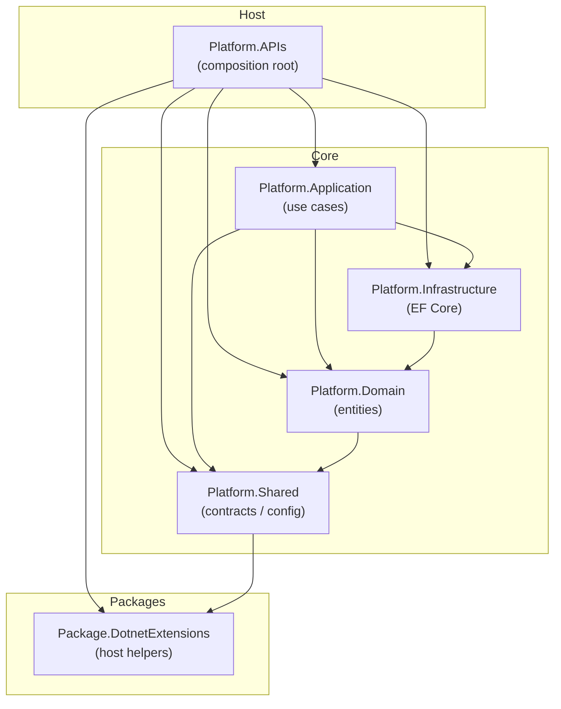

# Platform Auth Template

Project mẫu .NET 8 theo kiến trúc phân lớp (layered / Clean Architecture–style), chỉ giữ phần **Authentication**. Dùng làm boilerplate khi khởi tạo API mới: copy cấu trúc, giữ quy ước, mở rộng feature theo cùng pattern.

| Thành phần | Giá trị |
|------------|---------|
| Runtime | .NET 8 |
| API style | Minimal APIs |
| CQRS | MediatR (Commands / Queries) |
| Persistence | EF Core + PostgreSQL (Npgsql) |
| Auth | JWT Bearer + Refresh Token + Azure AD SSO (tùy chọn) |

---

## Mục lục

1. [Cấu trúc solution](#1-cấu-trúc-solution)
2. [Sơ đồ phụ thuộc giữa các lớp](#2-sơ-đồ-phụ-thuộc-giữa-các-lớp)
3. [Chi tiết từng lớp](#3-chi-tiết-từng-lớp)
4. [Luồng request mẫu](#4-luồng-request-mẫu)
5. [API endpoints](#5-api-endpoints)
6. [Quy ước & pattern](#6-quy-ước--pattern)
7. [Chạy project](#7-chạy-project)

---

## 1. Cấu trúc solution

```
Platform.sln
README.md
src/
  Platform.Application/                 # solution folder (không phải project)
    Platform.APIs/                      # Host / composition root
    Platform.Application/               # Use cases (MediatR + services)
    Platform.Domain/                    # Entities (auth domain)
    Platform.Infrastructure/            # EF Core DbContext + migrations
    Platform.Shared/                    # Config, response envelope, constants
  Platform.Packages/
    Package.DotnetExtensions/           # Helper host: SetupEnvs, MigrateDatabase
```

Mỗi project tương ứng một **trách nhiệm rõ ràng**. Host (`Platform.APIs`) là nơi gắn mọi thứ lại: DI, middleware, endpoint, seed data.

---

## 2. Sơ đồ phụ thuộc giữa các lớp

### 2.1. ProjectReference (ai tham chiếu ai)

Mũi tên `A → B` nghĩa là **A phụ thuộc vào B** (A có `ProjectReference` tới B).



### 2.2. Bảng phụ thuộc

| Project | Phụ thuộc vào | Vai trò trong chuỗi phụ thuộc |
|---------|---------------|-------------------------------|
| **Platform.APIs** | Application, Domain, Infrastructure, Shared, DotnetExtensions | Lớp ngoài cùng — biết mọi layer để wire DI & map HTTP |
| **Platform.Application** | Domain, Infrastructure, Shared | Orchestration nghiệp vụ; gọi DbContext trực tiếp |
| **Platform.Infrastructure** | Domain | Persist entity Domain xuống PostgreSQL |
| **Platform.Domain** | Shared | Model nghiệp vụ thuần (POCO); dùng `BaseEntity` từ Shared |
| **Platform.Shared** | DotnetExtensions | Kiểu dùng chung, không chứa logic nghiệp vụ |
| **Package.DotnetExtensions** | *(không)* | Tiện ích host độc lập, tái sử dụng được |

### 2.3. Sơ đồ lớp logic (từ ngoài vào trong)

```
┌─────────────────────────────────────────────────────────────┐
│  Platform.APIs                                              │
│  HTTP · JWT · Swagger · CORS · DI · Seed · Minimal Endpoints│
└───────────────────────────┬─────────────────────────────────┘
                            │ gửi Command/Query (MediatR)
                            ▼
┌─────────────────────────────────────────────────────────────┐
│  Platform.Application                                       │
│  Handlers → IAuthService → JwtTokenService / RestHttpClient │
└───────────────┬─────────────────────────────┬───────────────┘
                │ đọc/ghi entity              │ dùng DbContext
                ▼                             ▼
┌───────────────────────────┐   ┌─────────────────────────────┐
│  Platform.Domain          │◄──│  Platform.Infrastructure    │
│  User, Role, UserRole,    │   │  PlatformDbContext          │
│  UserIdentity, UserStatus │   │  Fluent API + Migrations    │
└─────────────┬─────────────┘   └─────────────────────────────┘
              │ BaseEntity, constants
              ▼
┌─────────────────────────────────────────────────────────────┐
│  Platform.Shared  →  Package.DotnetExtensions               │
│  AppSettings, ApiResponse, ServiceOutcome, BaseEntity       │
└─────────────────────────────────────────────────────────────┘
```

### 2.4. Lưu ý kiến trúc


- `Platform.Application` **tham chiếu trực tiếp** `Platform.Infrastructure` (`PlatformDbContext`).
- **Không** có repository interface trong Domain / Application ports.
- MediatR handler trả về `IResult` → Application có `FrameworkReference` tới ASP.NET Core.

Ưu điểm khi làm template nhỏ: ít abstraction, dễ đọc, dễ copy. Khi scale lớn hơn, có thể tách port (`IUserStore`, …) và đảo chiều phụ thuộc Application ← Infrastructure.

---

## 3. Chi tiết từng lớp

### 3.1. `Platform.APIs` — Host / Composition Root

**Việc của lớp này:** khởi động web app, đăng ký DI, cấu hình auth/CORS/Swagger, map endpoint, migrate DB khi start, seed dữ liệu nền.

| Thành phần | Đường dẫn | Mô tả |
|------------|-----------|--------|
| `Program.cs` | gốc project | Pipeline startup |
| `Registers.cs` | gốc project | `AddService()`, `AddDbContext()` |
| `AuthEndPoint` | `Endpoints/Auth/` | Nhóm route `/api/auth/*` |
| `AuthorizationEndpointExtensions` | `Extensions/` | Helper `RequireRoles(...)` |
| `DataSeed` | `Application/MigrateData/` | Seed role `ADMIN`, `USER` |
| Config | `AppSettings/` | `appsettings.{Environment}.json` |

**Thứ tự khởi động (`Program.cs`):**

1. `SetupEnvs` → bind `AppSettings` (singleton)
2. Swagger + JWT Bearer scheme
3. MediatR (scan assembly Application) + `AddService` + `AddDbContext` + `HttpClient`
4. Authentication / Authorization / CORS
5. Build → CORS → `MigrateDatabase<PlatformDbContext>` → AuthN/AuthZ → Swagger (Dev)
6. Map `AuthEndPoint` + `GET api/me`
7. `DataSeed.SeedAsync` → `Run`

**DI đăng ký trong `Registers`:**

| Lifetime | Service |
|----------|---------|
| Singleton | `IJwtTokenService` → `JwtTokenService` |
| Singleton | `IPasswordHasher<User>` → `PasswordHasher<User>` |
| Singleton | `IRestHttpClient` → `RestHttpClient` |
| Scoped | `IAuthService` → `AuthService` |
| Scoped (EF) | `PlatformDbContext` (Npgsql) |

> Config nằm trong `AppSettings/`, **không** dùng `appsettings.json` ở root project — nhờ `Package.DotnetExtensions.SetupEnvs`.

---

### 3.2. `Platform.Application` — Use cases

**Việc của lớp này:** nhận Command/Query từ API, xử lý nghiệp vụ auth, phát JWT, gọi Azure AD khi SSO.

```
Platform.Application/
  MediatR/Auth/
    Commands/     SignUp, RefreshToken, SsoLogin
    Queries/      SignIn
  Services/Auth/  IAuthService, AuthService, JwtTokenService
  Http/           IRestHttpClient, RestHttpClient
  Common/         AuthQueryExtensions (query helper trên DbContext)
  Responses/Auth/ AuthResponse
  Assembly.cs     Marker cho MediatR RegisterServicesFromAssembly
```

| Type | Vai trò |
|------|---------|
| `SignInQuery` + `Handler` | Đăng nhập email/password |
| `SignUpCommand` + `Handler` | Đăng ký user mới |
| `RefreshTokenCommand` + `Handler` | Xoay refresh token |
| `SsoLoginCommand` + `Handler` | Đổi authorization code Azure AD → JWT local |
| `IAuthService` / `AuthService` | Logic nghiệp vụ auth (gọi DbContext) |
| `IJwtTokenService` / `JwtTokenService` | Tạo access/refresh token |
| `IRestHttpClient` / `RestHttpClient` | HTTP ra ngoài (SSO token endpoint) |
| `AuthResponse` | DTO `(AccessToken, RefreshToken)` |

**Quy ước handler:** mỗi Command/Query là `record` implement `IRequest<IResult>`, kèm `internal class Handler` lồng bên trong. Handler mỏng — gọi service, bắt exception → `ApiResponse`.

---

### 3.3. `Platform.Domain` — Domain model

**Việc của lớp này:** mô tả thực thể auth. Chỉ POCO + enum; **không** interface repository, **không** domain service.

```
Platform.Domain/Platform/Auth/
  User.cs
  Role.cs
  UserRole.cs
  UserIdentity.cs
  UserStatus.cs
```

| Entity | Ý nghĩa |
|--------|---------|
| `User` | Email, password hash, status, refresh token hash/expiry, last login — kế thừa `BaseEntity` |
| `Role` | `Code` + `Name` (unique `Code`) |
| `UserRole` | Join `(UserId, RoleId)` — **không** kế thừa `BaseEntity` |
| `UserIdentity` | Liên kết IdP ngoài (`Provider` + `ProviderUserId`) |
| `UserStatus` | `Active` \| `Suspended` |

Domain chỉ phụ thuộc Shared để dùng `BaseEntity` (Id, Created/Updated audit fields).

---

### 3.4. `Platform.Infrastructure` — Persistence

**Việc của lớp này:** map Domain → PostgreSQL qua EF Core; Fluent API; migrations; audit khi `SaveChangesAsync`.

```
Platform.Infrastructure/Persistence/PlatformContext/
  PlatformDbContext.cs
  Migrations/
    InitialAuth...
    PlatformDbContextModelSnapshot.cs
```

| Thành phần | Mô tả |
|------------|--------|
| `PlatformDbContext` | `DbSet`: Users, Roles, UserRoles, UserIdentities |
| Migrations | Tạo schema; history table `__EFMigrationsHistory` |
| Audit | Gán `CreatedAt/By`, `UpdatedAt/By` từ JWT claims khi save |

**Bảng DB:**

| Table | Ghi chú |
|-------|---------|
| `Users` | Unique `Email` |
| `Roles` | Unique `Code` |
| `UserRoles` | PK ghép `(UserId, RoleId)` |
| `UserIdentities` | Unique `(Provider, ProviderUserId)` |

---

### 3.5. `Platform.Shared` — Cross-cutting

**Việc của lớp này:** kiểu & hằng dùng chung giữa các layer — config typed, envelope response, base entity, role constants.

| Type | Vai trò |
|------|---------|
| `AppSettings`, `JwtSettings`, `AzureAd`, `ConnectionStrings` | Bind từ JSON config |
| `BaseEntity` | `Id` (Guid), audit fields |
| `Response<T>` / `ApiResponse<T>` | Envelope API (`IsSuccess`, `Data`, `Message`, `StatusCode`) |
| `ServiceOutcome<T>` / `ServiceOutcomeHttp` | Kết quả service → `IResult` / `ApiResponse` |
| `AuthIdentityConstants` | `"ADMIN"`, `"USER"` |

---

### 3.6. `Package.DotnetExtensions` — Host helpers

Package tái sử dụng (namespace `Platform.DotnetExtensions`), không phụ thuộc project Platform khác.

| Extension | Việc làm |
|-----------|----------|
| `EnvironmentExtensions.SetupEnvs` | Load `AppSettings/appsettings.{Env}.json` + env vars → đăng ký singleton |
| `WebHostExtensions.MigrateDatabase` | Migrate DB khi start (Polly retry) + optional seeder |

---

## 4. Luồng request mẫu

### Sign-in (`POST /api/auth/sign-in`)

```mermaid
sequenceDiagram
    participant Client
    participant API as Platform.APIs<br/>AuthEndPoint
    participant MediatR
    participant Handler as SignInQuery.Handler
    participant Svc as AuthService
    participant Db as PlatformDbContext
    participant Jwt as JwtTokenService

    Client->>API: POST /api/auth/sign-in
    API->>MediatR: Send(SignInQuery)
    MediatR->>Handler: Handle(...)
    Handler->>Svc: SignIn(email, password)
    Svc->>Db: Find User by email
    Svc->>Svc: Verify password hash
    Svc->>Db: GetRoleCodesAsync
    Svc->>Jwt: CreateAccessToken + CreateRefreshToken
    Svc->>Db: Persist RefreshTokenHash
    Svc-->>Handler: ServiceOutcome&lt;AuthResponse&gt;
    Handler-->>API: IResult (ApiResponse)
    API-->>Client: 200 + tokens
```

**Tóm tắt các bước nghiệp vụ:**

1. Endpoint nhận body → `ISender.Send(SignInQuery)`
2. Handler gọi `IAuthService.SignIn`
3. Service tìm user (email normalize `Trim().ToLowerInvariant()`), verify password
4. Lấy role codes → tạo access JWT + refresh token
5. Lưu hash refresh token, cập nhật `LastLoginAt`
6. Trả `ServiceOutcome` → `ApiResponse<AuthResponse>`

**Biến thể khác:**

| Flow | Hành vi chính |
|------|----------------|
| **Sign-up** | Tạo `User` + `UserIdentity` + `UserRole` (mặc định `ADMIN`) → issue tokens |
| **SSO** | Đổi code Azure AD qua `IRestHttpClient` → tạo user role `USER` nếu chưa có |
| **Refresh** | Lookup user theo SHA-256 hash refresh token → rotate tokens |

---

## 5. API endpoints

| Method | Route | MediatR | Auth |
|--------|-------|---------|------|
| `POST` | `/api/auth/sign-up` | `SignUpCommand` | Anonymous |
| `POST` | `/api/auth/sign-in` | `SignInQuery` | Anonymous |
| `POST` | `/api/auth/refresh-token` | `RefreshTokenCommand` | Anonymous |
| `POST` | `/api/auth/sso` | `SsoLoginCommand` | Anonymous |
| `GET` | `/api/me` | Inline trong `Program.cs` | `RequireAuthorization()` |

Swagger (Dev): `http://localhost:5080/swagger`

---

## 6. Quy ước & pattern

| Pattern | Cách dùng trong project |
|---------|-------------------------|
| **Minimal APIs** | `MapGroup` / `MapPost` — không dùng Controllers |
| **CQRS nhẹ** | Folder `Commands/` vs `Queries/`; MediatR |
| **Application service** | Handler mỏng, logic nằm trong `IAuthService` |
| **Result envelope** | `ServiceOutcome<T>` → `ApiResponse<T>` |
| **JWT** | Access token ngắn hạn + refresh token hash trên `User` |
| **Password** | `PasswordHasher<User>` (Identity Core), không dùng full ASP.NET Identity stack |
| **Audit** | Tự gán trong `SaveChangesAsync` từ claims |
| **Seed** | Role `ADMIN` / `USER` khi startup |
| **Config** | `AppSettings/appsettings.{Environment}.json` |

**Quy ước đặt tên / code:**

1. Mutation → `*Command`; đọc/login → `*Query`
2. Handler lồng `internal` trong record request
3. Role codes là string constants, không enum trong JWT
4. PK = `Guid` (client-side `Guid.NewGuid()` trên entity)
5. Feature folder theo domain: `MediatR/Auth`, `Endpoints/Auth`, `Platform/Auth`

**Gợi ý mở rộng feature mới (theo mẫu này):**

1. Thêm entity trong `Platform.Domain`
2. Cấu hình Fluent API + migration trong `Platform.Infrastructure`
3. Thêm Command/Query + Service trong `Platform.Application`
4. Map endpoint Minimal API trong `Platform.APIs`
5. Đăng ký DI trong `Registers` nếu có service mới

---

## 7. Chạy project

### 7.1. Cấu hình

Sửa `src/Platform.Application/Platform.APIs/AppSettings/appsettings.Development.json`:

- `ConnectionStrings:DefaultConnection` — PostgreSQL
- `Jwt` — Issuer, Audience, SigningKey, thời hạn token
- `AzureAd` — (tùy chọn) SSO
- `CorsOrigins` — origin frontend (để trống = allow any)

### 7.2. Migration (lần đầu hoặc khi đổi model)

```bash
dotnet ef migrations add InitialAuth ^
  --project src/Platform.Application/Platform.Infrastructure ^
  --startup-project src/Platform.Application/Platform.APIs ^
  --output-dir Persistence/PlatformContext/Migrations
```

*(Trên PowerShell dùng `` ` `` thay `^` để xuống dòng.)*

Migrate chạy **tự động** khi app start (`MigrateDatabase`).

### 7.3. Run

```bash
dotnet run --project src/Platform.Application/Platform.APIs
```

- API: `http://localhost:5080`
- Swagger: `http://localhost:5080/swagger`

Roles `ADMIN` và `USER` được seed khi khởi động.
